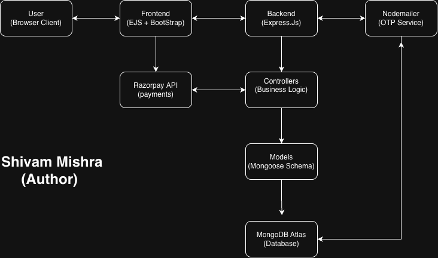

# 💈 Salon Booking Web App

A full-stack web application where users can search salons by location, view services, book available slots, and make payments using Razorpay.

---

## 🚀 Features

* 🔐 User Authentication (Signup/Login with Email OTP Verification)
* 🔍 Search salons by location
* 💇 View salon services and available slots
* 📅 Real-time slot booking (prevents double booking)
* 💳 Razorpay payment integration (Test Mode)
* 👤 Role-based access:

  * User (book services)
  * Salon Owner (manage services & bookings)
  * Admin (future scope)
* 📦 Session-based authentication
* 📧 Email verification using OTP (Nodemailer)

---

## 🛠️ Tech Stack

**Backend:**

* Node.js
* Express.js

**Frontend:**

* EJS (Embedded JavaScript Templates)
* HTML, CSS, Bootstrap

**Database:**

* MongoDB (Mongoose)

**Other Tools:**

* Nodemailer (Email OTP)
* Razorpay (Payment Gateway)

---

## 📁 Project Structure

```
salon-booking-app/
│
├── models/
├── routes/
├── controllers/
├── views/
│   ├── user/
│   ├── salon/
│   ├── admin/
│   └── partials/
│
├── public/
├── config/
├── middleware/
│
├── .env
├── .env.example
├── Dockerfile
├── docker-compose.yml
├── app.js
├── package.json
```

---

## ⚙️ Requirements

### 1. Install Dependencies

```
npm install
```

---

### 2. Environment Variables

Create a `.env` file in the root directory and copy from `.env.example`:

#### 📄 `.env.example`

```
PORT=3000

MONGO_URI=mongodb://mongo:27017/salonApp

SESSION_SECRET=your_secret_key

EMAIL=your_gmail
EMAIL_PASS=your_app_password

RAZORPAY_KEY_ID=your_key_id
RAZORPAY_KEY_SECRET=your_secret
```

#### 📌 Notes:

* `MONGO_URI`:

  * **Docker:** `mongodb://mongo:27017/salonApp`
  * **Local MongoDB:** `mongodb://localhost:27017/salonApp`
* `EMAIL_PASS`: Use Gmail App Password (not normal password)
* Razorpay keys: Use test keys for development

---

### 3. Run the Project

#### ▶️ Normal Run

```
npm run dev
```

OR

```
node app.js
```

---

## 🐳 Run with Docker (Recommended)

### 🔹 Build & Start Containers

```
docker-compose up --build
```

### 🔹 Run in Background

```
docker-compose up -d --build
```

### 🔹 Stop Containers

```
docker-compose down
```

### 🔹 View Logs

```
docker-compose logs -f
```

---

## 💳 Razorpay Test Details

Use test card:

```
Card Number: 4111 1111 1111 1111
Expiry: Any future date
CVV: 123
OTP: 1234
```

---

## 📧 Email Setup

* Enable 2-Step Verification in Gmail
* Generate App Password
* Use it in `.env`

---

## 🔄 Application Flow

1. User signs up → receives OTP → verifies email
2. User logs in
3. Searches salons by location
4. Selects service & slot
5. Makes payment via Razorpay
6. Booking is confirmed after payment success

---

## 🏗️ Architecture Diagram



---

## 🚀 Future Improvements

* Admin dashboard
* Reviews & ratings
* Real-time notifications
* Deployment (Render / AWS)
* Payment verification (signature validation)

---

## 👨‍💻 Author

**Shivam Mishra**

---

## ⭐ If you like this project

Give it a star ⭐ on GitHub!
